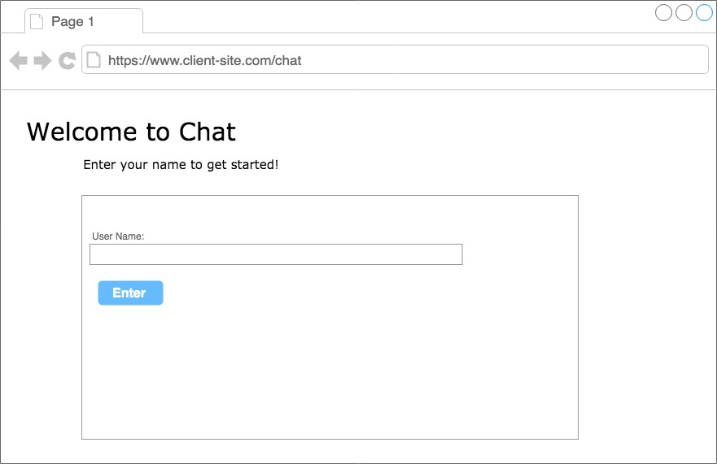
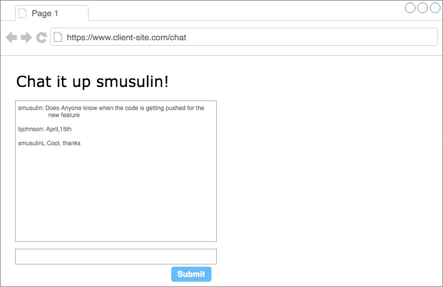

## Interview App
This is a simple boilerplate shell for creating a small application.  

Please create a small chat application with two main pages. The first page will be a form with an input for providing your username and a button to enter the chat room. 

The second page will be the chat room itself, with a list of messages that have been sent and a form with an input and a button for submitting messages.

A primary restriction you have is that, because this will be an embeddable widget, the application must not affect the browser history of the client.   

Due to time constraints, don't worry about perfect styling or testing, but let us know how you would do both.  
 
## Available Scripts

In the project directory, you can run:
### `npm install `

### `npm start`

Runs the app in the development mode. 
Open [http://localhost:3000](http://localhost:3000) to view it in the browser.

The page will reload if you make edits. 
You will also see any lint errors in the console.

### `npm test`

Launches the test runner in the interactive watch mode. 

## Mockups

