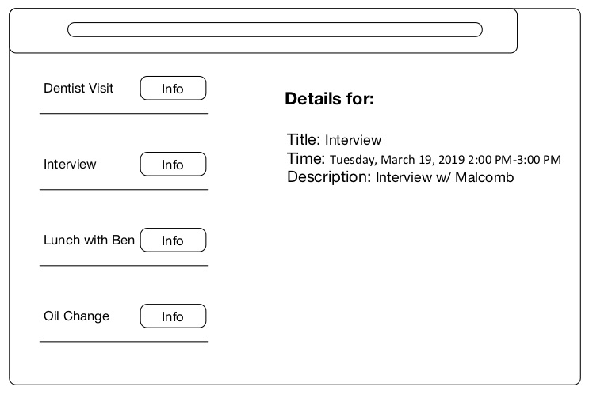

## Interview App
This is a simple boilerplate shell for creating a small application.  

Please create a small app that shows a list of appointments and details. A mockup has been provided ('appt-list.jpg'') in the root directory and a small amount of data has been provided in the '/data' directory. 

When a user clicks on the 'Info' button, the details on the right hand side should change to reflect the currently selected appointment. 

## Available Scripts

In the project directory, you can run:

### `npm start`

Runs the app in the development mode. 
Open [http://localhost:3000](http://localhost:3000) to view it in the browser.

The page will reload if you make edits. 
You will also see any lint errors in the console.

### `npm test`

Launches the test runner in the interactive watch mode. 

